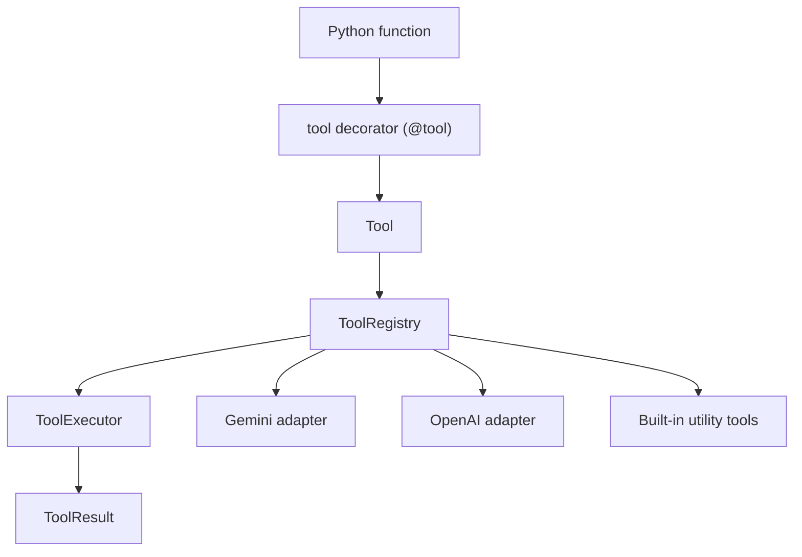

# llm-tools-kit

[](https://www.python.org/)
[](https://github.com/danishali778/llm-tools-kit/actions/workflows/ci.yml)
[](https://docs.astral.sh/ruff/)
[](https://docs.pytest.org/)
[](https://docs.pydantic.dev/)

`llm-tools-kit` is a Python toolkit for building safe, reusable tools for LLM agents.

It currently gives you:

- A typed tool system built around `@tool`, `Tool`, `ToolRegistry`, `ToolExecutor`, and `ToolResult`
- A Gemini adapter that turns registered tools into Gemini `functionDeclarations`
- An OpenAI adapter that turns registered tools into Responses API function tools
- Built-in utility tools for JSON extraction and repair, text chunking, safe local file access, local note memory, public web content fetching, and secret redaction

The package is intentionally small and explicit. The core stays provider-neutral, adapters stay separate, and tests avoid hidden network calls.

## Documentation

Project documentation lives under [`docs/`](docs/):

- [`docs/architecture.md`](docs/architecture.md)
- [`docs/creating_tools.md`](docs/creating_tools.md)
- [`docs/gemini_adapter.md`](docs/gemini_adapter.md)
- [`docs/openai_adapter.md`](docs/openai_adapter.md)
- [`docs/langchain_adapter.md`](docs/langchain_adapter.md)
- [`docs/safety.md`](docs/safety.md)
- [`docs/tool_reference.md`](docs/tool_reference.md)
- [`docs/packaging.md`](docs/packaging.md)
- [`docs/mcp_export.md`](docs/mcp_export.md)

## Why This Exists

Most agent projects start with a few helper functions and quickly turn into a pile of ad hoc wrappers, string parsing, and runtime surprises. This project is aimed at the opposite direction:

- Define tools once as normal Python functions
- Infer input schemas from function signatures
- Validate arguments with Pydantic
- Register and execute tools predictably
- Export the same tools to model providers without rewriting core logic

## Current Scope

| Area | Status | Notes |
| --- | --- | --- |
| Core tool system | Implemented | `@tool`, registry, executor, structured results, custom errors |
| Gemini adapter | Implemented | Schema export plus Gemini-style tool call execution helper |
| OpenAI adapter | Implemented | Responses API schema export plus function-call execution helper |
| JSON utilities | Implemented | `extract_json`, `repair_json` |
| Text utilities | Implemented | `chunk_text` |
| File utilities | Implemented | `read_file_safe`, `list_files_safe`, `search_files_safe` |
| Memory utilities | Implemented | `save_memory`, `get_memory`, `search_memory` |
| Web utilities | Implemented | `fetch_url_text`, `clean_html`, `extract_links` |
| Secret redaction | Implemented | `detect_secrets`, `redact_secrets` |
| MCP export | Implemented | Optional stdio server export from `ToolRegistry` |
| LangChain adapter | Implemented | Optional export of local tools to LangChain `StructuredTool` objects |
| Live provider SDK integration | Not yet included | No Gemini or OpenAI SDK dependency in the package today |
| Safety layer foundation | Implemented | `ToolContext`, risk metadata, approval enforcement, path-bounded file access |

## Installation

This project is currently source-first rather than PyPI-first.

```bash
git clone https://github.com/danishali778/llm-tools-kit.git
cd llm-tools-kit
python -m pip install -e ".[dev]"
```

Minimum runtime:

- Python `3.11+`
- `pydantic`

Development dependencies:

- `pytest`
- `ruff`

Optional extras:

- `mcp` for MCP server export
- `langchain` for LangChain `StructuredTool` export

## Quickstart

```python
from agent_tools import ToolRegistry, tool


@tool
def add(a: int, b: int) -> int:
    """Add two numbers."""
    return a + b


registry = ToolRegistry([add])
result = registry.run("add", a=2, b=3)

print(result.ok)       # True
print(result.output)   # 5
```

Decorated tools are still directly callable:

```python
assert add(2, 3) == 5
assert add.run(a=2, b=3) == 5
```

## Core Concepts

### `@tool`

`@tool` wraps a Python function into a `Tool` object with:

- `name`
- `description`
- `input_schema`
- `func`
- optional `tags`
- optional `metadata`

Descriptions are inferred from the function docstring when available.

### `ToolRegistry`

`ToolRegistry` stores tools by name and gives you one place to execute them.

```python
registry = ToolRegistry([add])
result = registry.run("add", a=2, b=3)
```

### `ToolResult`

Tool execution returns a structured result instead of raw exceptions leaking through normal agent paths.

```python
ToolResult(
    tool_name="add",
    ok=True,
    output=5,
    error=None,
    error_type=None,
)
```

Validation failures and missing-tool failures return `ok=False` with an `error_type`.

## Gemini Adapter

The current provider adapter targets Gemini function calling without requiring the Gemini SDK.

Available helpers:

- `to_gemini_function_declaration(tool)`
- `to_gemini_function_declarations(tools)`
- `to_gemini_tool(tools)`
- `execute_gemini_tool_call(tool_call, registry)`

Example:

```python
from agent_tools import ToolRegistry, tool
from agent_tools.adapters import execute_gemini_tool_call, to_gemini_tool


@tool
def add(a: int, b: int) -> int:
    """Add two numbers."""
    return a + b


registry = ToolRegistry([add])
tool_config = to_gemini_tool(registry.tools)

tool_call = {"name": "add", "args": {"a": 2, "b": 3}}
result = execute_gemini_tool_call(tool_call, registry)
```

Generated Gemini tool config shape:

```python
{
    "functionDeclarations": [
        {
            "name": "add",
            "description": "Add two numbers.",
            "parameters": {
                "type": "object",
                "properties": {
                    "a": {"type": "integer"},
                    "b": {"type": "integer"},
                },
                "required": ["a", "b"],
            },
        }
    ]
}
```

What this adapter does today:

- Converts tool schemas into Gemini-compatible parameter declarations
- Accepts Gemini-style tool calls as either mappings or objects with `name` and `args`
- Routes execution through `ToolRegistry`

What it does not do yet:

- Call the Gemini API directly
- Manage chats, sessions, retries, or streaming
- Add the Gemini Python SDK as a package dependency

## OpenAI Adapter

The OpenAI adapter targets Responses API function tools without requiring the
OpenAI SDK.

Available helpers:

- `to_openai_tool(tool)`
- `to_openai_tools(tools)`
- `execute_openai_tool_call(tool_call, registry)`

Example:

```python
from agent_tools import ToolRegistry, tool
from agent_tools.adapters import execute_openai_tool_call, to_openai_tools


@tool
def add(a: int, b: int) -> int:
    """Add two numbers."""
    return a + b


registry = ToolRegistry([add])
tools = to_openai_tools(registry.tools)

tool_call = {"name": "add", "arguments": "{\"a\": 2, \"b\": 3}"}
result = execute_openai_tool_call(tool_call, registry)
```

Generated OpenAI tool shape:

```python
[
    {
        "type": "function",
        "name": "add",
        "description": "Add two numbers.",
        "parameters": {
            "type": "object",
            "properties": {
                "a": {"type": "integer"},
                "b": {"type": "integer"},
            },
            "required": ["a", "b"],
        },
    }
]
```

What this adapter does today:

- Converts tool schemas into OpenAI Responses API function tool definitions
- Accepts function calls as mappings or objects with `name` and `arguments`
- Parses JSON string arguments and routes execution through `ToolRegistry`

What it does not do yet:

- Call the OpenAI API directly
- Manage chats, sessions, retries, or streaming
- Add the OpenAI Python SDK as a package dependency
- Target Chat Completions tool-call payloads

## Built-In Tools

### JSON tools

Module: `agent_tools.tools.json_tools`

| Tool | Purpose | Notes |
| --- | --- | --- |
| `extract_json(text)` | Extract the first valid JSON object or array from text | Handles plain JSON, fenced code blocks, and balanced object/array segments |
| `repair_json(text)` | Repair common JSON formatting issues and parse the result | Removes trailing commas and can recover simple Python-style literals |

Example:

```python
from agent_tools.tools import extract_json, repair_json

payload = extract_json('Model response: {"status": "ok"}')
fixed = repair_json("{'roles': ['admin',],}")
```

### Text tools

Module: `agent_tools.tools.text_tools`

| Tool | Purpose | Notes |
| --- | --- | --- |
| `chunk_text(text, max_chars=4000)` | Split text into bounded chunks | Tries to split on spaces before falling back to hard boundaries |

Example:

```python
from agent_tools.tools import chunk_text

chunks = chunk_text("alpha beta gamma delta", max_chars=10)
```

### File tools

Module: `agent_tools.tools.file_tools`

| Tool | Purpose | Notes |
| --- | --- | --- |
| `read_file_safe(path, base_dir=".", max_chars=1_000_000)` | Read a UTF-8 text file within an allowed base directory | Rejects path escape attempts and overly large files |
| `list_files_safe(directory=".", base_dir=".", pattern="*", recursive=True, max_results=200)` | List files relative to an allowed base directory | Returns relative paths |
| `search_files_safe(directory, query, base_dir=".", pattern="*", case_sensitive=False, max_results=50)` | Search text files and return matching lines | Output format is `relative/path:line_number:line` |

Important limitations:

- File access is intentionally local and conservative
- Reads are UTF-8 only
- Paths are resolved relative to a bounded `base_dir`
- This is not a shell tool or a generic filesystem abstraction

### Web tools

Module: `agent_tools.tools.web_tools`

| Tool | Purpose | Notes |
| --- | --- | --- |
| `fetch_url_text(url, timeout_seconds=10.0, max_bytes=1_000_000)` | Fetch a public webpage and return readable text | Allows only HTTP/HTTPS and enforces timeout and size limits |
| `clean_html(html)` | Convert raw HTML into readable text | Removes `script`, `style`, and `noscript` content |
| `extract_links(url, timeout_seconds=10.0, max_bytes=1_000_000)` | Fetch a public webpage and return unique absolute links | Skips empty and fragment-only links |

Important limitations:

- No browser automation or JavaScript rendering
- No login/session support
- No anti-bot bypass behavior
- Some sites may block ordinary HTTP client access

### Secret redaction

Module: `agent_tools.safety.redaction`

| Tool | Purpose | Notes |
| --- | --- | --- |
| `detect_secrets(text)` | Detect likely secrets using common token patterns | Currently scans for likely OpenAI, GitHub, and Gemini-style tokens |
| `redact_secrets(text)` | Replace detected secrets with typed redaction markers | Returns the redacted string |

Example:

```python
from agent_tools.tools import detect_secrets, redact_secrets

findings = detect_secrets("sk-test_1234567890abcdefghijklmnop")
clean = redact_secrets("token: sk-test_1234567890abcdefghijklmnop")
```

This is intentionally heuristic, not a full secret scanner.

## End-to-End Example

```python
from agent_tools import ToolRegistry
from agent_tools.tools import chunk_text, extract_json, redact_secrets


registry = ToolRegistry([extract_json, chunk_text, redact_secrets])

payload = registry.run(
    "extract_json",
    text='Result: {"title": "Phase 3", "status": "started"}',
)

chunks = registry.run(
    "chunk_text",
    text="Phase 3 adds built-in utility tools for agent workflows.",
    max_chars=18,
)

clean = registry.run(
    "redact_secrets",
    text="demo key: sk-test_1234567890abcdefghijklmnop",
)
```

See also:

- [basic_tool.py](examples/basic_tool.py)
- [gemini_schema.py](examples/gemini_schema.py)
- [openai_schema.py](examples/openai_schema.py)
- [memory_tools.py](examples/memory_tools.py)
- [webpage_summary_agent.py](examples/webpage_summary_agent.py)
- [utility_tools.py](examples/utility_tools.py)
- [docs/creating_tools.md](docs/creating_tools.md)
- [docs/tool_reference.md](docs/tool_reference.md)

## Environment Variables

The repository includes [.env.example](.env.example):

```env
GEMINI_API_KEY=
GEMINI_MODEL=gemini-2.0-flash
OPENAI_API_KEY=
```

These are optional today.

- `GEMINI_API_KEY` is intended for future live Gemini examples
- `GEMINI_MODEL` is a convenience default for those examples
- `OPENAI_API_KEY` is intended for future live OpenAI examples

The current package and tests do not require these variables.

## Project Layout

```txt
src/
  agent_tools/
    __init__.py
    core/
    adapters/
    tools/
    safety/

tests/
examples/
```

Current package organization:

- `core/`: tool model, registry, executor, results, errors
- `adapters/`: provider-specific exports and execution helpers
- `tools/`: reusable built-in tools
- `safety/`: focused safety helpers such as redaction

## Architecture



This split is deliberate:

- the core knows how to validate and execute tools
- adapters know how to expose tools to providers
- built-in tools are regular tools built on top of the same system

## Development

Install development dependencies:

```bash
python -m pip install -e ".[dev]"
```

Install MCP support:

```bash
python -m pip install -e ".[mcp,dev]"
```

Install LangChain support:

```bash
python -m pip install -e ".[langchain,dev]"
```

Run checks:

```bash
python -m ruff check .
python -m pytest
```

Run examples:

```bash
python examples/basic_tool.py
python examples/gemini_schema.py
python examples/openai_schema.py
python examples/langchain_tools.py
python examples/memory_tools.py
python examples/mcp_stdio_server.py
python examples/webpage_summary_agent.py
python examples/utility_tools.py
```

CI currently runs on:

- Python `3.11`
- Python `3.12`

## Roadmap

The project has moved through three concrete slices so far:

1. Core tool system
2. Gemini adapter
3. First utility tools

Likely next areas:

- richer utility tools
- stronger safety context and approval controls
- live provider integration examples
- additional provider adapters

## Current Limitations

- No packaged live Gemini client integration yet
- No packaged live OpenAI client integration yet
- File tools are intentionally conservative and UTF-8 only
- Secret detection is heuristic, not exhaustive
- The larger safety layer described in planning is not fully implemented yet

## License

This project is licensed under the [MIT License](LICENSE).
