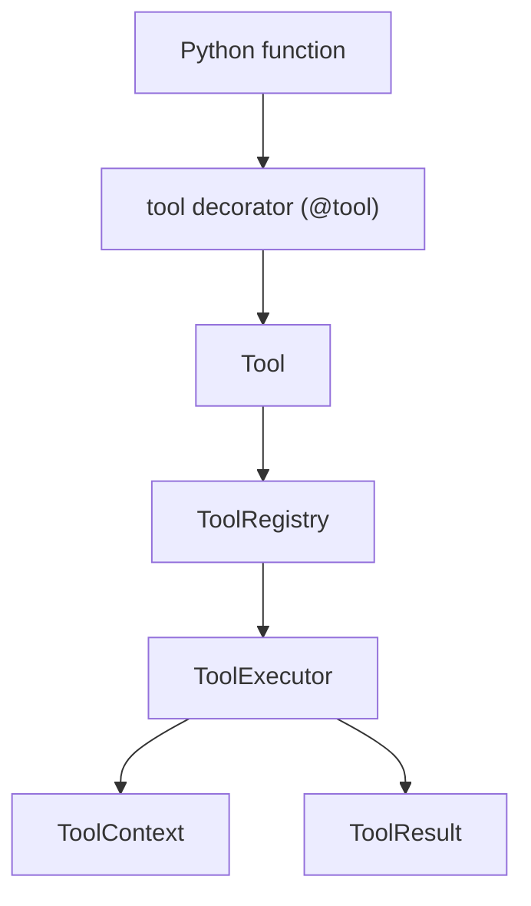

# Architecture

`llm-tools-kit` is structured around a small core with optional layers on top.

## Design Goals

- Keep the execution model provider-neutral
- Make tool definitions look like normal Python functions
- Validate inputs consistently
- Keep adapters separate from the core runtime
- Add safety as an explicit layer instead of scattering it across random helpers

## Package Layout

```txt
src/agent_tools/
  core/
  adapters/
  tools/
  safety/
```

## Core Flow



### `@tool`

The decorator converts a Python function into a `Tool` object with:

- a name
- a description
- an inferred Pydantic input schema
- risk metadata
- approval requirements

### `ToolRegistry`

The registry stores tools by name and exposes:

- registration
- lookup
- execution through the executor

### `ToolExecutor`

The executor is responsible for:

- resolving tools from the registry
- validating inputs
- applying context and permission rules
- returning structured `ToolResult` instances

### `ToolContext`

`ToolContext` carries execution-time safety settings such as:

- `allowed_directories`
- `approved_tools`
- `require_approval`
- `max_file_size_bytes`

## Adapters

Adapters translate the provider-neutral core into provider-specific formats.

The current adapter layer includes:

- Gemini function declaration export
- Gemini-style tool call execution helper

The key architectural rule is that adapters depend on the core, but the core does not depend on a provider SDK.

## Built-In Tools

Built-in tools are regular tools built on top of the core system.

Current groups:

- JSON tools
- text tools
- file tools
- secret redaction

This keeps the extension model simple: a built-in tool is not special, it is just a normal `@tool` that happens to ship with the package.

## Safety Layer

The safety layer sits between tool invocation and tool side effects.

Current responsibilities:

- risk-level normalization
- approval enforcement
- path-bounded file access
- allowed-directory enforcement
- context-aware file size enforcement

Future work can build on this without changing the public execution model.
